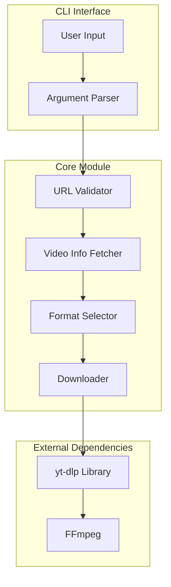
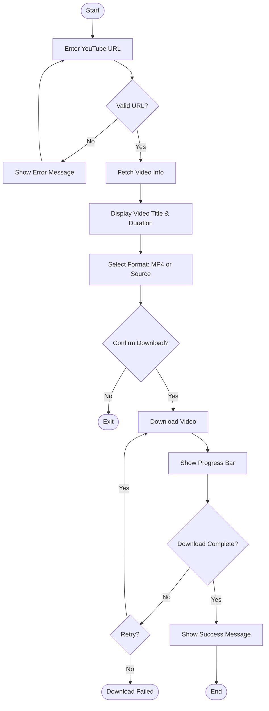
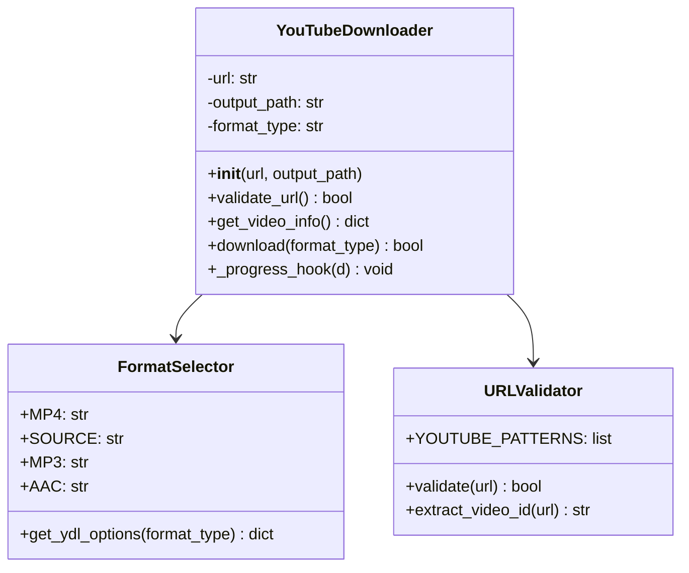
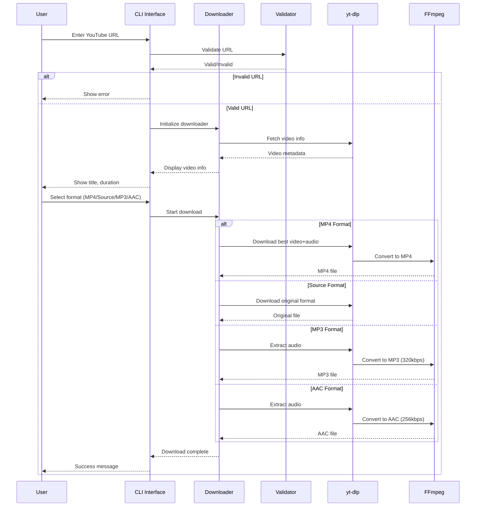
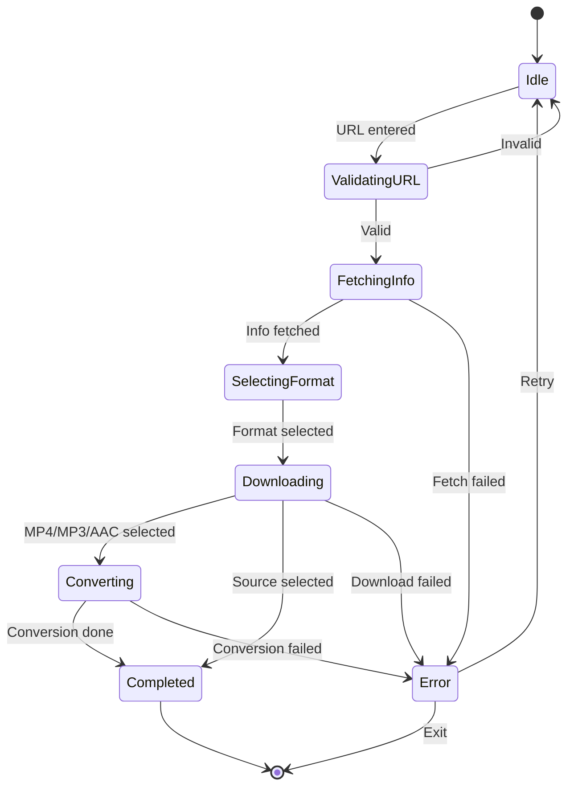

# Product Requirements Document (PRD)
## YouTube Video Downloader

**Version:** 1.0  
**Date:** January 1, 2026  
**Author:** Development Team

---

## 1. Overview

A Python command-line tool that allows users to download videos from YouTube. Users can select the output format:

- **Video formats:** MP4 (converted) or Source (original format)
- **Audio formats:** MP3 or AAC (audio extraction)

---

## 2. Objectives

- Provide a simple CLI interface for downloading YouTube videos
- Support four download modes:
  - **MP4** — Video conversion to MP4 format
  - **Source** — Original video format (webm, mkv, etc.)
  - **MP3** — Audio extraction in MP3 format
  - **AAC** — Audio extraction in AAC format
- Handle errors gracefully with clear user feedback
- Ensure cross-platform compatibility (macOS, Linux, Windows)

---

## 3. Functional Requirements

### 3.1 Core Features

| ID | Feature | Description |
|----|---------|-------------|
| F1 | URL Input | Accept YouTube video URL as input |
| F2 | Format Selection | Allow user to choose between MP4, Source, MP3, or AAC format |
| F3 | Download Video | Download video with progress indicator |
| F4 | Output Location | Save file to current directory or user-specified path |
| F5 | Filename Handling | Use video title as filename (sanitized) |

### 3.2 Format Options

| Option | Type | Description |
|--------|------|-------------|
| **MP4** | Video | Convert/download video as MP4 file with best quality |
| **Source** | Video | Download in original format (webm, mkv, etc.) with highest available quality |
| **MP3** | Audio | Extract audio and convert to MP3 format (320kbps) |
| **AAC** | Audio | Extract audio and convert to AAC format (256kbps) |

---

## 4. Non-Functional Requirements

| Requirement | Description |
|-------------|-------------|
| Performance | Download should utilize maximum available bandwidth |
| Reliability | Retry mechanism for failed downloads |
| Usability | Clear prompts and progress feedback |
| Compatibility | Python 3.8+ support |

---

## 5. Technical Architecture

### 5.1 System Components



### 5.2 User Flow



### 5.3 Module Structure



---

## 6. Dependencies

| Package | Purpose | Required |
|---------|---------|----------|
| `yt-dlp` | YouTube video extraction and download | Yes |
| `ffmpeg` | Video/audio conversion (MP4, MP3, AAC) | Yes (for all formats except Source) |

---

## 6.1 Environment Setup (macOS)

### Prerequisites

```bash
# Install FFmpeg via Homebrew
brew install ffmpeg
```

### Virtual Environment Setup

```bash
# Navigate to project directory
cd youtube-downloader

# Create virtual environment using python3
python3 -m venv .venv

# Activate virtual environment
source .venv/bin/activate

# Install dependencies
pip install -r requirements.txt

# Verify installation
python3 -c "import yt_dlp; print('yt-dlp installed successfully')"
```

### Deactivate Virtual Environment

```bash
deactivate
```

---

## 7. CLI Interface Design

### 7.1 Usage Examples

```bash
# Activate virtual environment first
source .venv/bin/activate

# Basic usage - interactive mode
python3 main.py

# With URL argument
python3 main.py --url "https://www.youtube.com/watch?v=VIDEO_ID"

# Download as MP4 video
python3 main.py --url "https://www.youtube.com/watch?v=VIDEO_ID" --format mp4

# Download as source/original format
python3 main.py --url "https://www.youtube.com/watch?v=VIDEO_ID" --format source

# Download as MP3 audio
python3 main.py --url "https://www.youtube.com/watch?v=VIDEO_ID" --format mp3

# Download as AAC audio
python3 main.py --url "https://www.youtube.com/watch?v=VIDEO_ID" --format aac

# Specify output directory
python3 main.py --url "https://www.youtube.com/watch?v=VIDEO_ID" --output ./downloads
```

### 7.2 Interactive Flow

```
$ source .venv/bin/activate
$ python3 main.py

YouTube Video Downloader
========================

Enter YouTube URL: https://www.youtube.com/watch?v=dQw4w9WgXcQ

Fetching video info...

Video: Never Gonna Give You Up
Duration: 3:33

Select format:
  [1] MP4  - Video (converted, best quality)
  [2] Source - Video (original format)
  [3] MP3  - Audio (320kbps)
  [4] AAC  - Audio (256kbps)

Your choice (1-4): 3

Downloading audio...
[████████████████████████████████] 100% - 3.2 MB

✓ Download complete: Never_Gonna_Give_You_Up.mp3
```

---

## 8. Error Handling

| Error Type | Handling |
|------------|----------|
| Invalid URL | Display error, prompt for re-entry |
| Network Error | Retry up to 3 times, then fail gracefully |
| Video Unavailable | Display reason (private, deleted, region-locked) |
| FFmpeg Missing | Warn user, fall back to source format |
| Disk Full | Display error with required space |

---

## 9. File Structure

```
youtube-downloader/
├── .venv/                 # Virtual environment (not in git)
├── docs/
│   └── PRD.md
├── src/
│   ├── __init__.py
│   ├── downloader.py      # Core download logic
│   ├── validator.py       # URL validation
│   └── utils.py           # Helper functions
├── main.py                # CLI entry point
├── requirements.txt       # Python dependencies
├── .gitignore             # Includes .venv/
├── README.md
└── LICENSE
```

---

## 10. Future Enhancements (Out of Scope for v1.0)

- Playlist download support
- GUI interface
- Download queue management
- Resume interrupted downloads
- Additional audio formats (FLAC, WAV, OGG)

---

## 11. Success Criteria

- [ ] Successfully download videos from standard YouTube URLs
- [ ] MP4 conversion works correctly with FFmpeg
- [ ] Source format preserves original quality
- [ ] MP3 audio extraction works correctly (320kbps)
- [ ] AAC audio extraction works correctly (256kbps)
- [ ] Progress indicator updates in real-time
- [ ] Error messages are clear and actionable
- [ ] Virtual environment setup works on macOS with python3

---

## 12. Sequence Diagram



---

## Appendix: State Diagram


